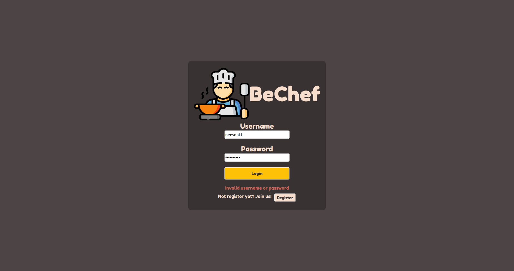
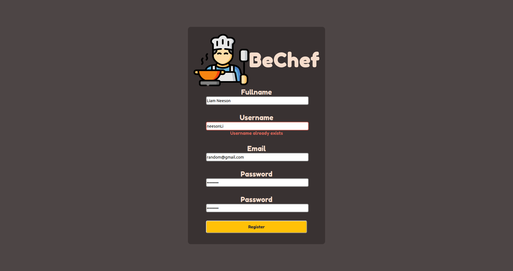
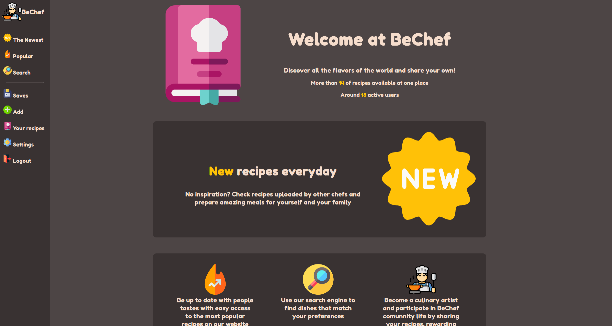
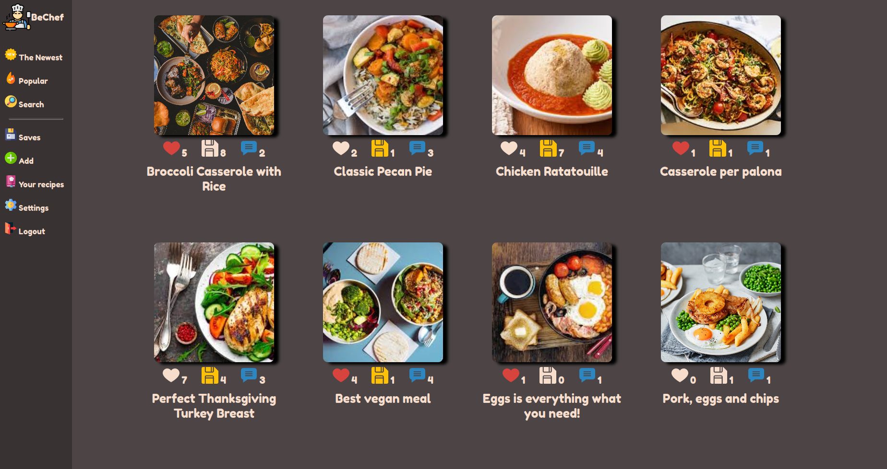
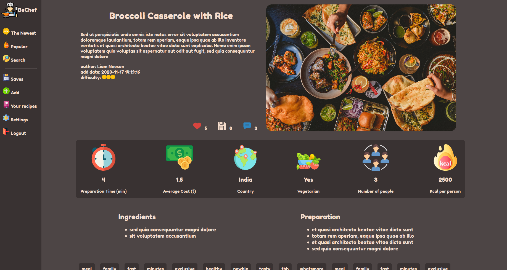
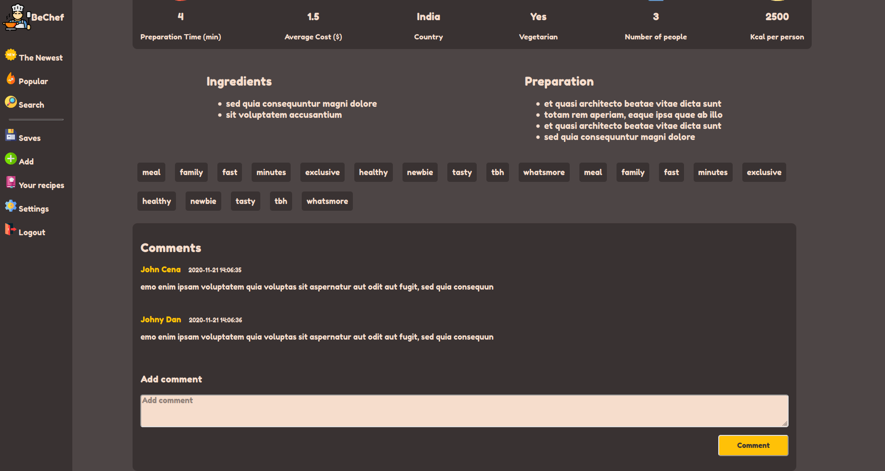
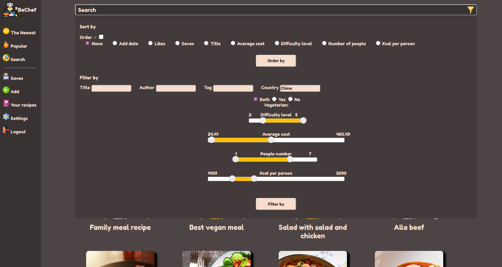
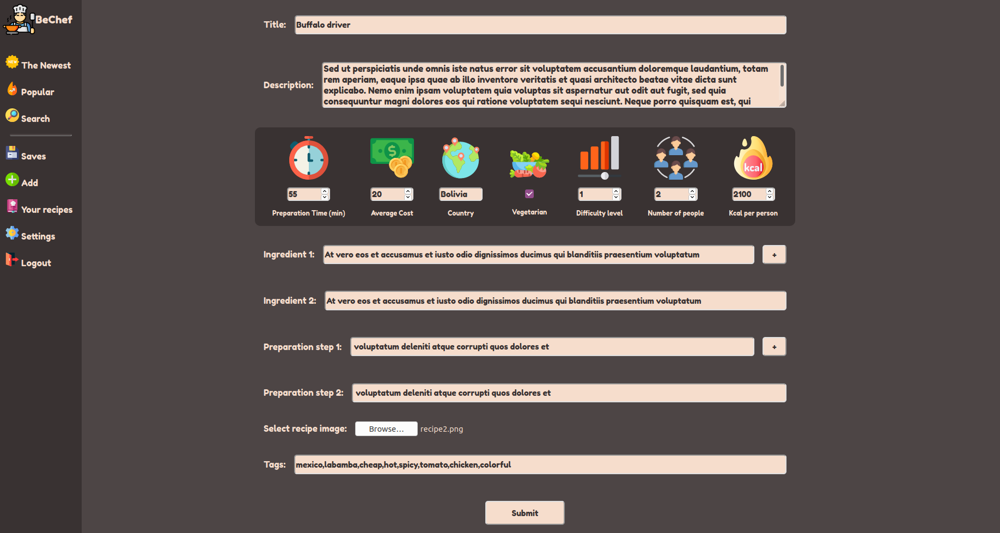
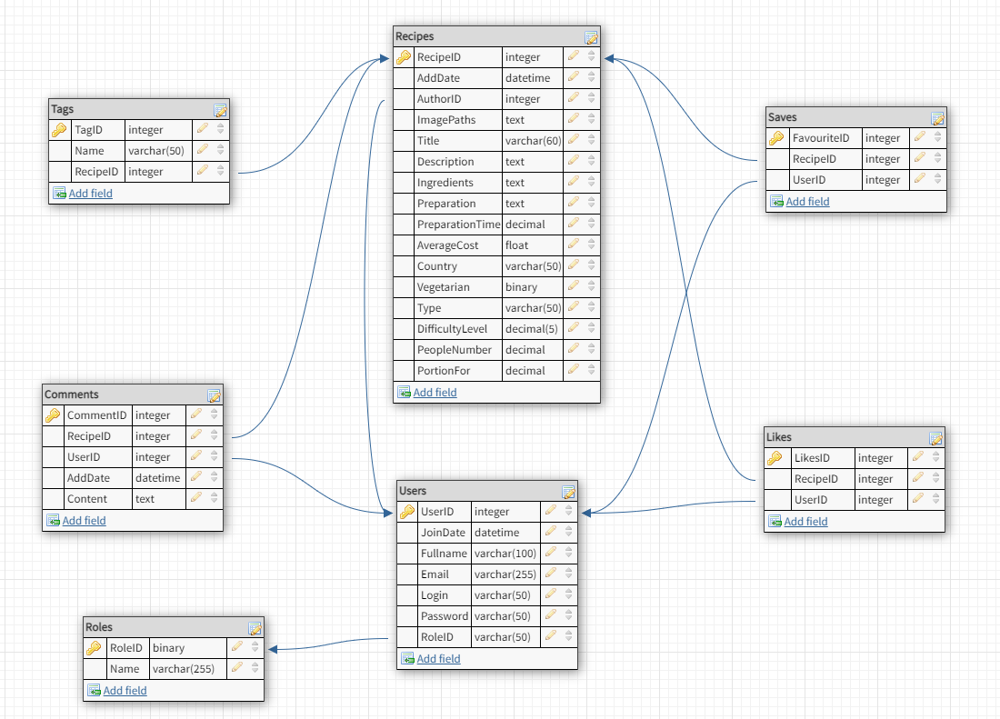

# BeChef

Simple cook portal based on php backend

## Tech stack

`Php 7.4.3`

`MariaDB 10.4.14`

`jQuery 3.5.1`

`jQueryUI 1.9.2`

## Login & Register

Login            |  Register
:-------------------------:|:-------------------------:
   |   

Login and register form are validated before sending data to the server. Ajax mechanisms allows to prevent default form submitting behaviour. Only in case of valid data it is forwarded to the server, otherwise corresponding error message are displayed.

## Home

Homepage provides basic info about site. At the right we can see navigation, sticked to the left. For unlogged user only `The Newest`, `Popular` and `Search` option are available and `Sign in` and `Sign up` buttons are displayed instead.

## Cards

`The Newest`, `Popular`, `Saves` and `Your recipes` provides the same view, but with corresponding to it's name recipe cards.
- `The Newest` - the most recent recipes
- `Popular` - recipes with the most number of likes (illustrated by hearts)
- `Saves` - recipes saved by user (illustrated by yellow disks)
- `Your recipes` - recipes authored by logged user

## Recipe

After clicking at recipe card, we are forwarded to recipe's view. We can find a lot of information pulled from the database. In here, logged user, can react on this recipe by liking it (heart click), saving it (disk click) or leaving a comment.

## Search

This view provides toggled search panel. By clicking `Order by` we are fetching recipes in order. Order checkbox indicates ascending or descending order and below options indicates column.
By clicking `Filter by` we are fetching recipes filtered by data from `Filter by` section.

## Add recipe

User can also add his own recipe by filling above form. Similar to login and register forms, add form is validated before sending data to the server.

## Settings

Not implemented yet

## Responsivness

Web is adjusted to all device sizes. For instance you can check mobile screenshots from `screenshot` directory named `mobile_*.png`.

# Database

Above diagram represents general structure of database. `BeChef.sql` available in repo, provide this database structure with few sample rows in each table.
